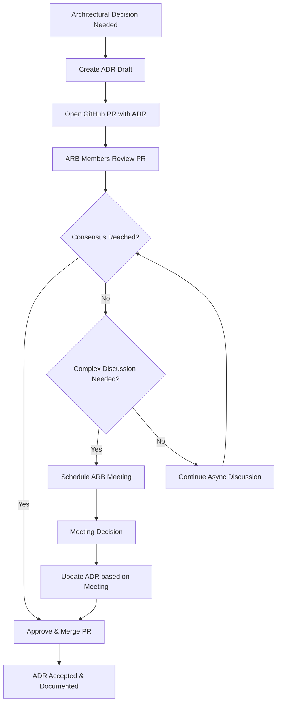

# ADR Process Documentation

This document provides comprehensive guidance for implementing and managing Architecture Decision Records (ADRs) in your organization.

## Table of Contents

- [ADR Process Overview](#adr-process-overview)
- [Architecture Review Board](#architecture-review-board)
- [Creating New ADRs](#creating-new-adrs)
- [ADR Format and Standards](#adr-format-and-standards)
- [Best Practices](#best-practices)
- [C4 Model Integration](#c4-model-integration)
- [Interactive ADR Browser](#interactive-adr-browser)
- [GitHub Automation](#github-automation)
- [Installation & Setup](#installation--setup)
- [Development Guide](#development-guide)
- [Deployment Options](#deployment-options)
- [Troubleshooting](#troubleshooting)

## ADR Process Overview

Our ADR process is designed to be lightweight yet thorough, leveraging GitHub's collaboration features for review and discussion.

### 1. Identify the Need for an ADR

When facing an architectural decision:
- Check existing ADRs to avoid duplication
- Determine if the decision warrants documentation
- Consider the impact and longevity of the decision

### 2. Create the ADR

1. **Copy the template**: Use [adr/template.md](adr/template.md)
2. **Number sequentially**: Use the next available number (e.g., 0007)
3. **Draft the content**: Fill in all sections thoroughly
4. **Add diagrams**: Include C4 diagrams where helpful
5. **Set status to "Proposed"**

### 3. Submit for Review

1. **Create a Pull Request**: Submit the ADR as a new PR
2. **Request reviews**: Tag relevant stakeholders and Architecture Review Board members
3. **Engage in discussion**: Respond to feedback and iterate on the ADR
4. **Address concerns**: Update the ADR based on review feedback

### 4. Decision and Approval

- **Architecture Review Board reviews** the ADR following the process in [ADR-0002](adr/0002-establish-architecture-review-board.md)
- **Consensus reached**: ADR status changed to "Accepted"
- **Implementation begins**: Teams can proceed with implementation
- **PR merged**: ADR becomes part of the official record

### 5. Update and Maintain

- **Update README**: Add the new ADR to the index
- **Monitor implementation**: Track how the decision plays out in practice
- **Update status**: Change to "Deprecated" or "Superseded" if needed
- **Learn and improve**: Use outcomes to inform future decisions

## Architecture Review Board

Our Architecture Review Board (ARB) operates primarily through GitHub Pull Requests, as detailed in [ADR-0002](adr/0002-establish-architecture-review-board.md).

### Review Process Overview



### ARB Composition
- Technical Leads from each major domain
- Principal Engineer for architectural oversight
- Product Architecture Representative for business alignment

### Review Criteria
- Technical feasibility and soundness
- Alignment with existing architecture
- Business value and cost considerations
- Risk assessment and mitigation
- Implementation complexity

## Creating New ADRs

### Step-by-Step Guide

1. **Determine ADR Number**
   ```bash
   # Find the next sequential number
   ls adr/ | grep -E '^[0-9]+' | sort -n | tail -1
   ```

2. **Copy Template**
   ```bash
   cp adr/template.md adr/NNNN-your-decision-title.md
   ```

3. **Write Your ADR**
   - Use clear, concise language
   - Include relevant background context
   - Explain alternatives considered
   - Be honest about consequences (positive and negative)
   - Add C4 diagrams if they help explain the decision

4. **Review Checklist**
   - [ ] Title is a clear, short noun phrase
   - [ ] Status is set appropriately
   - [ ] Context explains the forces at play
   - [ ] Decision is clearly stated
   - [ ] Consequences are comprehensive and honest
   - [ ] Alternatives considered are mentioned
   - [ ] Diagrams support understanding (if applicable)

5. **Submit for Review**
   - Create GitHub PR
   - Update README index
   - Request ARB review
   - Engage with feedback

## ADR Format and Standards

All ADRs follow the standard format from [adr.github.io](https://adr.github.io/):

### Required Sections

#### Title
- Short noun phrase describing the decision
- Use imperative mood (e.g., "Use microservices architecture")
- Be specific and descriptive

#### Status  
- **Proposed**: Under review
- **Accepted**: Approved and active
- **Deprecated**: No longer recommended
- **Superseded**: Replaced by newer decision

#### Context
- Describe the situation requiring a decision
- Explain the forces at play (technical, business, organizational)
- Include constraints and requirements
- Reference related ADRs if applicable

#### Decision
- State the chosen solution clearly
- Explain the reasoning behind the choice
- Include key implementation details
- Reference supporting evidence or research

#### Consequences
- List all outcomes (positive, negative, neutral)
- Be honest about trade-offs and risks
- Consider long-term implications
- Include implementation requirements

### Optional Sections

- **Alternatives Considered**: Other options evaluated
- **References**: Links to research, articles, or discussions
- **Implementation Notes**: Specific guidance for implementers
- **Related Decisions**: Links to related ADRs

## Best Practices

### Writing Effective ADRs

1. **Be Concise but Complete**: Capture essential information without unnecessary detail
2. **Use Plain Language**: Avoid jargon; write for future team members
3. **Include Visuals**: Use diagrams to clarify complex decisions
4. **Show Your Work**: Explain alternatives and trade-offs considered
5. **Be Honest**: Include negative consequences and risks
6. **Keep It Current**: Update status when decisions change

### Organizational Best Practices

1. **Regular Reviews**: Periodically review ADR status and relevance
2. **Link from Code**: Reference ADRs in code comments where relevant
3. **Onboarding Integration**: Include ADR review in new team member onboarding
4. **Architecture Alignment**: Ensure new decisions align with existing ADRs
5. **Process Evolution**: Continuously improve the ADR process based on experience

### Common Pitfalls to Avoid

- **Too Much Detail**: ADRs should be concise, not comprehensive specifications
- **Post-hoc Documentation**: Write ADRs when making decisions, not after
- **Avoiding Negative Consequences**: Be honest about trade-offs and limitations
- **Ignoring Alternatives**: Show what other options were considered
- **Set and Forget**: ADRs need maintenance as circumstances change

## C4 Model Integration

We enhance our ADRs with [C4 model](https://c4model.com/) diagrams using Mermaid syntax to provide visual context for architectural decisions. The C4 model helps visualize architecture at different levels of detail.

### C4 Diagram Types Used

#### Context Diagrams (Level 1)
- **Purpose**: Show system boundaries and external dependencies
- **Use Case**: High-level system architecture decisions
- **Example**: [ADR-0003 Microservices Architecture](adr/0003-adopt-microservices-architecture.md)

#### Container Diagrams (Level 2)  
- **Purpose**: Show high-level technology choices and data flow
- **Use Case**: Technology stack and deployment decisions
- **Example**: [ADR-0004 Database Per Service](adr/0004-choose-database-per-service.md)

#### Component Diagrams (Level 3)
- **Purpose**: Show internal structure of containers/services
- **Use Case**: Detailed service design decisions
- **Example**: [ADR-0005 API Gateway Pattern](adr/0005-implement-api-gateway-pattern.md)

#### Dynamic Diagrams
- **Purpose**: Show workflow and process flows over time
- **Use Case**: Process and communication pattern decisions
- **Examples**: [ADR-0002 Architecture Review Board](adr/0002-establish-architecture-review-board.md), [ADR-0006 Event-Driven Communication](adr/0006-use-event-driven-communication.md)

### Mermaid Integration Benefits

- **Version Controlled**: Diagrams are stored as code alongside ADRs
- **GitHub Native**: Renders automatically in GitHub markdown
- **Maintainable**: Easy to update diagrams as architecture evolves
- **Collaborative**: Changes can be reviewed through pull requests

## Interactive ADR Browser

This repository features a modern Go-based web application that provides an interactive, real-time interface for browsing and exploring ADRs with advanced features.

### Key Features

- 🚀 **Dynamic Rendering**: Markdown files rendered on-the-fly with intelligent caching
- 📱 **Responsive Design**: Optimized for desktop, tablet, and mobile devices  
- 🌓 **Dark Mode**: Smart theme toggle with system preference detection
- 🔍 **Real-time Search**: Instant search across all ADRs with status filters
- 📊 **Status Tracking**: Visual indicators for all ADR lifecycle states
- 🗂️ **Smart Navigation**: Collapsible category groups and flat list views
- 📈 **Interactive Diagrams**: Advanced Mermaid diagram viewer with zoom controls
- ⌨️ **Keyboard Shortcuts**: Quick access with Ctrl/Cmd+K for search, Escape to clear

### Advanced Diagram Features

The ADR browser includes a sophisticated diagram viewer with:

- **🔍 Zoom Controls**: Zoom in/out with buttons, mouse wheel, or trackpad gestures
- **🖱️ Pan & Navigate**: Click and drag to explore large diagrams  
- **📱 Gesture Support**: Natural pinch-to-zoom with zoom-to-cursor positioning
- **🎯 Fullscreen Mode**: Click any diagram for detailed fullscreen view
- **🌙 Theme Aware**: Proper text colors in both light and dark modes
- **⚡ Smooth Performance**: Optimized interactions with gesture detection

### Technical Architecture

The ADR browser uses a modern, efficient architecture:

#### **Smart Caching System**
- **SHA-256 Content Hashing**: Tracks file changes for intelligent cache invalidation
- **In-Memory Rendering Cache**: Avoids re-processing unchanged markdown files
- **Dynamic Cache Management**: Automatically refreshes when source files change
- **Zero-Downtime Updates**: Content updates without server restart

#### **Performance Optimizations**
- **On-Demand Rendering**: Only processes requested ADRs, not entire site
- **Efficient Routing**: Fast URL pattern matching and request handling
- **Template Optimization**: Reusable template compilation and execution
- **Asset Serving**: Static assets served efficiently with proper headers

#### **Modern Web Features**
- **Tailwind CSS Integration**: Utility-first styling with custom prose plugin
- **GitHub-Style Syntax Highlighting**: Prism.js with proper dark mode support
- **Responsive Design**: Mobile-first approach with flexbox layouts
- **Progressive Enhancement**: Works without JavaScript, enhanced with JS

## GitHub Automation

This repository includes comprehensive GitHub Actions workflows that automate and validate the ADR process, ensuring consistency and quality across all architectural decisions.

### GitHub Actions Workflows

#### 🔍 ADR Validation (`adr-validation.yml`)
**Triggers**: Pull requests and pushes affecting ADR files  
**Purpose**: Comprehensive validation of ADR structure and consistency

**What it checks:**
- **Sequential Numbering**: Ensures ADRs are numbered sequentially (0001, 0002, etc.)
- **No Duplicates**: Prevents multiple ADRs with the same number
- **Required Sections**: Validates presence of Status, Context, Decision, Consequences
- **Valid Status**: Ensures status is one of: Proposed, Accepted, Deprecated, Superseded  
- **README Consistency**: Verifies all ADRs are referenced in README index
- **Broken Links**: Checks for broken internal markdown links
- **Markdown Linting**: Validates markdown formatting

#### 🔄 Auto-Update Index (`adr-index-update.yml`)
**Triggers**: Pushes to main branch with new ADR files  
**Purpose**: Automatically maintains the README ADR index

**What it does:**
- **Generates Index**: Creates up-to-date table with ADR numbers, titles, status
- **Detects C4 Diagrams**: Automatically identifies diagram types (Context, Container, Component, Dynamic)
- **Smart Updates**: Only commits changes when index actually changes
- **Auto-Commit**: Commits updates with descriptive message

#### 📋 Template & PR Check (`adr-template-check.yml`)
**Triggers**: Pull requests with ADR changes  
**Purpose**: Validates new ADRs follow template and provides PR feedback

**What it validates:**
- **Template Compliance**: Ensures new ADRs follow the standard template
- **No Placeholder Text**: Checks that template placeholders have been replaced
- **Meaningful Content**: Validates sections contain actual content, not just headers
- **Naming Convention**: Enforces `0000-kebab-case-title.md` format
- **Numbering Conflicts**: Prevents conflicts with existing ADR numbers
- **PR Comments**: Adds helpful validation results as PR comments

#### 🚀 Build & Deploy (`build-and-test.yml`)
**Triggers**: Pushes to main branch, pull requests  
**Purpose**: Build and test the Go ADR server

**What it does:**
- **Go Build**: Compiles the ADR server application
- **Run Tests**: Executes unit and integration tests
- **Static Analysis**: Runs Go vet and other static analysis tools
- **Generate Artifacts**: Creates deployable binaries
- **Validate Functionality**: Tests server startup and basic functionality

#### ✅ Setup Validation (`validate-setup.yml`)
**Triggers**: Pull requests, manual dispatch  
**Purpose**: Comprehensive validation of repository setup

**What it validates:**
- **File Structure**: Verifies all critical files are present
- **ADR Format**: Runs full ADR structure validation
- **Index Generation**: Tests the ADR index generation process
- **Web App**: Basic validation of JavaScript and CSS files
- **Statistics**: Provides repository health metrics

### GitHub Integration Features

#### Pull Request Workflow
1. **Create ADR**: Developer creates new ADR following template
2. **Open PR**: Submit ADR as pull request
3. **Automatic Validation**: GitHub Actions validate structure, numbering, format
4. **PR Comments**: Automated feedback posted to PR
5. **Review Process**: Architecture Review Board reviews via GitHub PR
6. **Merge & Update**: Upon merge, README index is automatically updated

#### Branch Protection (Recommended)
```yaml
# .github/branch-protection.yml (example configuration)
protection_rules:
  main:
    required_status_checks:
      - "ADR Validation"
      - "ADR Pull Request Validation"
    required_reviews: 2
    require_code_owner_reviews: true
    required_reviewers:
      - architecture-review-board
```

## Installation & Setup

### Prerequisites

Ensure you have Go installed (version 1.19 or later):

```bash
# Check Go version
go version

# Install Go if needed (macOS with Homebrew)
brew install go

# Or download from https://golang.org/dl/
```

### Quick Setup

```bash
# Clone the repository
git clone https://github.com/your-org/adr-demo.git
cd adr-demo

# Install dependencies
go mod tidy

# Start the ADR browser
go run main.go serve

# Open in your browser
open http://localhost:8080
```

### Command Options

```bash
# Build static files only
go run main.go build --output-dir ./dist

# Serve with custom configuration  
go run main.go serve --port 3000 --host 0.0.0.0

# Verbose output for debugging
go run main.go serve --verbose
```

### Environment Configuration

```bash
# Set custom port
export ADR_PORT=3000

# Enable verbose logging
export ADR_VERBOSE=true

# Custom ADR directory (default: ./adr)
export ADR_DIRECTORY=./docs/adrs
```

## Development Guide

### GitHub Actions Setup

1. **Enable Workflows**: GitHub Actions are automatically enabled when you add workflow files to `.github/workflows/`

2. **Configure Permissions**: Ensure your repository has these permissions:
   - **Contents**: Write (for committing README updates)
   - **Pull Requests**: Write (for adding PR comments)

3. **Set Up Branch Protection** (Optional):
   ```bash
   # Using GitHub CLI
   gh api repos/:owner/:repo/branches/main/protection \
     --method PUT \
     --field required_status_checks='{"strict":true,"contexts":["ADR Validation"]}' \
     --field required_pull_request_reviews='{"required_approving_review_count":1}'
   ```

4. **Configure Code Owners**: Create `.github/CODEOWNERS`:
   ```
   # Require Architecture Review Board approval for ADRs
   adr/ @your-org/architecture-review-board
   ```

### Development Tools

- **ADR Tools**: Command-line tools ([adr-tools](https://github.com/npryce/adr-tools))
- **Mermaid Live Editor**: [mermaid.live](https://mermaid.live) for diagram editing
- **PlantUML**: Alternative for complex diagrams
- **Markdown Linters**: Ensure consistent formatting

### Command Line Helpers

```bash
# Find next ADR number
ls adr/ | grep -E '^[0-9]{4}' | sort -n | tail -1 | sed 's/^\([0-9]*\).*/\1/' | xargs printf "%04d\n" | xargs -I {} expr {} + 1 | xargs printf "%04d\n"

# Create new ADR from template
cp adr/template.md adr/$(next_adr_number)-your-decision-title.md

# Validate local ADRs before committing
find adr -name '[0-9][0-9][0-9][0-9]-*.md' | while read file; do
  echo "Checking $file..."
  grep -q "^## Status" "$file" || echo "Missing Status section"
  grep -q "^## Context" "$file" || echo "Missing Context section" 
  grep -q "^## Decision" "$file" || echo "Missing Decision section"
  grep -q "^## Consequences" "$file" || echo "Missing Consequences section"
done
```

## Deployment Options

### Local Development
```bash
go run main.go serve --port 8080
```

### Production Build
```bash
go build -o adr-server
./adr-server serve --host 0.0.0.0 --port 80
```

### Docker (Optional)
```dockerfile
FROM golang:1.21-alpine AS builder
WORKDIR /app
COPY . .
RUN go build -o adr-server

FROM alpine:latest
RUN apk --no-cache add ca-certificates
WORKDIR /root/
COPY --from=builder /app/adr-server .
COPY --from=builder /app/adr ./adr
COPY --from=builder /app/templates ./templates
COPY --from=builder /app/static ./static
CMD ["./adr-server", "serve", "--host", "0.0.0.0", "--port", "8080"]
```

## Troubleshooting

### Common Issues

#### ADR Validation Failures
- **Duplicate Numbers**: Use the next sequential number available
- **Missing Sections**: Ensure all required sections are present
- **Invalid Status**: Use only: Proposed, Accepted, Deprecated, Superseded
- **Template Text**: Replace all placeholder text from template

#### GitHub Actions Issues
- **Permission Errors**: Ensure repository has write permissions for contents
- **Workflow Failures**: Check Actions tab for detailed error messages
- **Manual Trigger**: Use workflow_dispatch to manually trigger workflows

#### Server Issues
- **Port Already in Use**: Change port with `--port` flag or `ADR_PORT` environment variable
- **File Not Found**: Ensure ADR files are in the correct directory structure
- **Template Errors**: Check Go template syntax in `templates/` directory

### Debugging Commands

```bash
# Check ADR file structure
find adr -name '[0-9][0-9][0-9][0-9]-*.md' | sort

# Test server locally
go run main.go serve --verbose --port 8081

# Validate ADR format manually
go run main.go build --verbose
```

### Getting Help

- **Issues**: Open an issue on the repository for bug reports
- **Discussions**: Use GitHub Discussions for questions and ideas
- **Documentation**: Refer to [adr.github.io](https://adr.github.io/) for ADR standards

## Contributing

We welcome contributions to improve this ADR demo and make it more useful for the community!

### How to Contribute

1. **Fork** this repository
2. **Create** a feature branch for your changes
3. **Make** your improvements (code, documentation, examples)
4. **Test** your changes locally with `go run main.go serve`
5. **Submit** a pull request with a clear description
6. **Engage** with feedback and iterate as needed

### Types of Contributions

- 🐛 **Bug Fixes**: Report and fix issues with the web interface or automation
- 📚 **Documentation**: Improve README, add examples, clarify processes
- 🎨 **UI/UX**: Enhance the web interface, improve responsiveness, add features
- 🔧 **Tooling**: Improve GitHub Actions, add new automation features
- 📋 **ADR Examples**: Add realistic ADRs to demonstrate different scenarios
- 🏗️ **Architecture**: Improve the Go server, caching, or template system

### Development Setup

```bash
# Fork and clone your fork
git clone https://github.com/YOUR-USERNAME/adr-demo.git
cd adr-demo

# Install dependencies
go mod tidy

# Start development server
go run main.go serve --verbose

# Run tests (if any)
go test ./...
```

### Questions or Ideas?

- 🐛 **Bug Reports**: Open an issue with detailed reproduction steps
- 💡 **Feature Requests**: Open an issue to discuss new ideas
- 💬 **General Questions**: Use GitHub Discussions
- 📧 **Private Concerns**: Contact the maintainers directly

---

*This repository serves as both documentation and demonstration of effective ADR practices. Use it as a template for your own projects and adapt the process to fit your team's needs.*