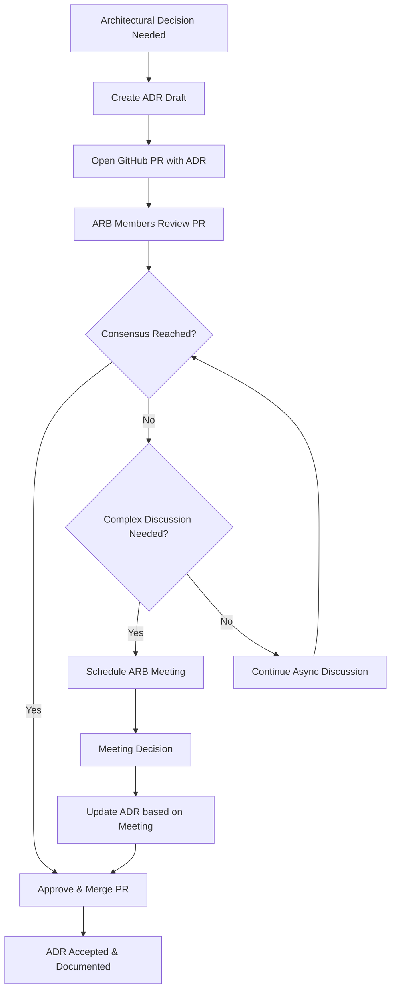

# Architecture Decision Records (ADR) Demo

This repository demonstrates best practices for documenting architectural decisions using Architecture Decision Records (ADRs) following the standards from [adr.github.io](https://adr.github.io/). It showcases a comprehensive approach to architectural governance, including review processes, visual documentation with C4 models, and practical examples from a realistic e-commerce platform.

## Table of Contents

- [What are ADRs?](#what-are-adrs)
- [Why Use ADRs?](#why-use-adrs)
- [ADR Index](#adr-index)
- [ADR Process](#adr-process)
- [Architecture Review Board](#architecture-review-board)
- [C4 Model Integration](#c4-model-integration)
- [Creating New ADRs](#creating-new-adrs)
- [ADR Format and Standards](#adr-format-and-standards)
- [Best Practices](#best-practices)
- [Tooling and Automation](#tooling-and-automation)
- [Example Project Context](#example-project-context)

## What are ADRs?

Architecture Decision Records (ADRs) are **lightweight documents that capture important architectural decisions** made during a project's development. Each ADR documents:

- **The decision made** and its rationale
- **The context** that led to the decision  
- **The consequences** (both positive and negative) of the decision
- **Alternative options** that were considered

ADRs help teams understand the reasoning behind architectural choices and maintain a historical record of decision-making that survives team changes and time.

## Why Use ADRs?

### Key Benefits

- **Knowledge Preservation**: Architectural decisions and their reasoning are documented for future reference
- **Onboarding**: New team members can understand the system's evolution and current state
- **Decision Transparency**: Everyone can see what decisions were made and why
- **Avoid Repeated Discussions**: Settled architectural matters don't need to be re-debated
- **Change Management**: Understanding past decisions helps evaluate future changes
- **Accountability**: Clear record of who decided what and when

### When to Create an ADR

Create an ADR when making decisions that:
- Affect the overall system architecture
- Have long-term consequences
- Involve significant trade-offs
- Impact multiple teams or components
- Introduce new technologies or patterns
- Change existing architectural patterns

## ADR Index

| ADR | Title | Status | C4 Diagram Type |
|-----|-------|--------|-----------------|
| [0001](docs/adr/0001-record-architecture-decisions.md) | Record Architecture Decisions | Accepted | - |
| [0002](docs/adr/0002-establish-architecture-review-board.md) | Establish Architecture Review Board | Accepted | Dynamic |
| [0003](docs/adr/0003-adopt-microservices-architecture.md) | Adopt Microservices Architecture | Accepted | Context |
| [0004](docs/adr/0004-choose-database-per-service.md) | Choose Database Per Service | Accepted | Container |
| [0005](docs/adr/0005-implement-api-gateway-pattern.md) | Implement API Gateway Pattern | Accepted | Component |
| [0006](docs/adr/0006-use-event-driven-communication.md) | Use Event-Driven Communication | Accepted | Dynamic |
| [0007](docs/adr/0007-implement-graphql-api.md) | Implement GraphQL API | Proposed | Component |
| [0008](docs/adr/0008-use-mongodb-for-session-storage.md) | Use MongoDB for Session Storage | Deprecated | Container |
| [0009](docs/adr/0009-use-redis-for-session-storage.md) | Use Redis for Session Storage | Superseded | Container |
| [0010](docs/adr/0010-adopt-hybrid-session-storage.md) | Adopt Hybrid Session Storage | Accepted | Component |

### ADR Status Definitions

- **Proposed**: Under review and discussion
- **Accepted**: Approved and being implemented
- **Deprecated**: No longer recommended but still in use
- **Superseded**: Replaced by a newer decision (link to replacement)

## ADR Process

Our ADR process is designed to be lightweight yet thorough, leveraging GitHub's collaboration features for review and discussion.

### 1. Identify the Need for an ADR

When facing an architectural decision:
- Check existing ADRs to avoid duplication
- Determine if the decision warrants documentation
- Consider the impact and longevity of the decision

### 2. Create the ADR

1. **Copy the template**: Use [docs/adr/template.md](docs/adr/template.md)
2. **Number sequentially**: Use the next available number (e.g., 0007)
3. **Draft the content**: Fill in all sections thoroughly
4. **Add diagrams**: Include C4 diagrams where helpful
5. **Set status to "Proposed"**

### 3. Submit for Review

1. **Create a Pull Request**: Submit the ADR as a new PR
2. **Request reviews**: Tag relevant stakeholders and Architecture Review Board members
3. **Engage in discussion**: Respond to feedback and iterate on the ADR
4. **Address concerns**: Update the ADR based on review feedback

### 4. Decision and Approval

- **Architecture Review Board reviews** the ADR following the process in [ADR-0002](docs/adr/0002-establish-architecture-review-board.md)
- **Consensus reached**: ADR status changed to "Accepted"
- **Implementation begins**: Teams can proceed with implementation
- **PR merged**: ADR becomes part of the official record

### 5. Update and Maintain

- **Update README**: Add the new ADR to the index
- **Monitor implementation**: Track how the decision plays out in practice
- **Update status**: Change to "Deprecated" or "Superseded" if needed
- **Learn and improve**: Use outcomes to inform future decisions

## Architecture Review Board

Our Architecture Review Board (ARB) operates primarily through GitHub Pull Requests, as detailed in [ADR-0002](docs/adr/0002-establish-architecture-review-board.md).

### Review Process Overview



### ARB Composition
- Technical Leads from each major domain
- Principal Engineer for architectural oversight
- Product Architecture Representative for business alignment

### Review Criteria
- Technical feasibility and soundness
- Alignment with existing architecture
- Business value and cost considerations
- Risk assessment and mitigation
- Implementation complexity

## C4 Model Integration

We enhance our ADRs with [C4 model](https://c4model.com/) diagrams using Mermaid syntax to provide visual context for architectural decisions. The C4 model helps visualize architecture at different levels of detail.

### C4 Diagram Types Used

#### Context Diagrams (Level 1)
- **Purpose**: Show system boundaries and external dependencies
- **Use Case**: High-level system architecture decisions
- **Example**: [ADR-0003 Microservices Architecture](docs/adr/0003-adopt-microservices-architecture.md)

#### Container Diagrams (Level 2)  
- **Purpose**: Show high-level technology choices and data flow
- **Use Case**: Technology stack and deployment decisions
- **Example**: [ADR-0004 Database Per Service](docs/adr/0004-choose-database-per-service.md)

#### Component Diagrams (Level 3)
- **Purpose**: Show internal structure of containers/services
- **Use Case**: Detailed service design decisions
- **Example**: [ADR-0005 API Gateway Pattern](docs/adr/0005-implement-api-gateway-pattern.md)

#### Dynamic Diagrams
- **Purpose**: Show workflow and process flows over time
- **Use Case**: Process and communication pattern decisions
- **Examples**: [ADR-0002 Architecture Review Board](docs/adr/0002-establish-architecture-review-board.md), [ADR-0006 Event-Driven Communication](docs/adr/0006-use-event-driven-communication.md)

### Mermaid Integration Benefits

- **Version Controlled**: Diagrams are stored as code alongside ADRs
- **GitHub Native**: Renders automatically in GitHub markdown
- **Maintainable**: Easy to update diagrams as architecture evolves
- **Collaborative**: Changes can be reviewed through pull requests

## Creating New ADRs

### Step-by-Step Guide

1. **Determine ADR Number**
   ```bash
   # Find the next sequential number
   ls docs/adr/ | grep -E '^[0-9]+' | sort -n | tail -1
   ```

2. **Copy Template**
   ```bash
   cp docs/adr/template.md docs/adr/NNNN-your-decision-title.md
   ```

3. **Write Your ADR**
   - Use clear, concise language
   - Include relevant background context
   - Explain alternatives considered
   - Be honest about consequences (positive and negative)
   - Add C4 diagrams if they help explain the decision

4. **Review Checklist**
   - [ ] Title is a clear, short noun phrase
   - [ ] Status is set appropriately
   - [ ] Context explains the forces at play
   - [ ] Decision is clearly stated
   - [ ] Consequences are comprehensive and honest
   - [ ] Alternatives considered are mentioned
   - [ ] Diagrams support understanding (if applicable)

5. **Submit for Review**
   - Create GitHub PR
   - Update README index
   - Request ARB review
   - Engage with feedback

## ADR Format and Standards

All ADRs follow the standard format from [adr.github.io](https://adr.github.io/):

### Required Sections

#### Title
- Short noun phrase describing the decision
- Use imperative mood (e.g., "Use microservices architecture")
- Be specific and descriptive

#### Status  
- **Proposed**: Under review
- **Accepted**: Approved and active
- **Deprecated**: No longer recommended
- **Superseded**: Replaced by newer decision

#### Context
- Describe the situation requiring a decision
- Explain the forces at play (technical, business, organizational)
- Include constraints and requirements
- Reference related ADRs if applicable

#### Decision
- State the chosen solution clearly
- Explain the reasoning behind the choice
- Include key implementation details
- Reference supporting evidence or research

#### Consequences
- List all outcomes (positive, negative, neutral)
- Be honest about trade-offs and risks
- Consider long-term implications
- Include implementation requirements

### Optional Sections

- **Alternatives Considered**: Other options evaluated
- **References**: Links to research, articles, or discussions
- **Implementation Notes**: Specific guidance for implementers
- **Related Decisions**: Links to related ADRs

## Best Practices

### Writing Effective ADRs

1. **Be Concise but Complete**: Capture essential information without unnecessary detail
2. **Use Plain Language**: Avoid jargon; write for future team members
3. **Include Visuals**: Use diagrams to clarify complex decisions
4. **Show Your Work**: Explain alternatives and trade-offs considered
5. **Be Honest**: Include negative consequences and risks
6. **Keep It Current**: Update status when decisions change

### Organizational Best Practices

1. **Regular Reviews**: Periodically review ADR status and relevance
2. **Link from Code**: Reference ADRs in code comments where relevant
3. **Onboarding Integration**: Include ADR review in new team member onboarding
4. **Architecture Alignment**: Ensure new decisions align with existing ADRs
5. **Process Evolution**: Continuously improve the ADR process based on experience

### Common Pitfalls to Avoid

- **Too Much Detail**: ADRs should be concise, not comprehensive specifications
- **Post-hoc Documentation**: Write ADRs when making decisions, not after
- **Avoiding Negative Consequences**: Be honest about trade-offs and limitations
- **Ignoring Alternatives**: Show what other options were considered
- **Set and Forget**: ADRs need maintenance as circumstances change

## GitHub Pages Deployment

This repository is configured for automatic deployment to GitHub Pages, providing a live web interface for browsing ADRs.

### Automatic Deployment

The site automatically deploys when:
- Changes are pushed to the `main` branch
- ADRs are added, modified, or removed
- The ADR index is updated

### Deployment Process

1. **ADR Index Generation**: Automatically generates `adr-index.json` from ADR files
2. **Validation**: Ensures all files are present and valid
3. **GitHub Pages Build**: Deploys the `docs/` directory as a static site
4. **Live Updates**: Site updates within minutes of pushing changes

### Local Testing

```bash
# Test the complete setup locally
make pages-test

# Generate index and serve
make serve

# Prepare for deployment
make pages-build
```

### Site Features

- 📱 **Responsive Design**: Works on desktop, tablet, and mobile
- 🌓 **Dark Mode**: Automatically follows system preference
- 🔍 **Search & Filter**: Find ADRs by title, number, or status
- 📊 **Status Tracking**: Visual indicators for all ADR lifecycle states
- 🗂️ **Table of Contents**: Easy navigation within ADR documents
- 📈 **Mermaid Diagrams**: Interactive C4 model and workflow diagrams

## Tooling and Automation

This repository includes comprehensive GitHub Actions workflows to automate and validate the ADR process, ensuring consistency and quality.

### GitHub Actions Workflows

#### 🔍 ADR Validation (`adr-validation.yml`)
**Triggers**: Pull requests and pushes affecting ADR files  
**Purpose**: Comprehensive validation of ADR structure and consistency

**What it checks:**
- **Sequential Numbering**: Ensures ADRs are numbered sequentially (0001, 0002, etc.)
- **No Duplicates**: Prevents multiple ADRs with the same number
- **Required Sections**: Validates presence of Status, Context, Decision, Consequences
- **Valid Status**: Ensures status is one of: Proposed, Accepted, Deprecated, Superseded  
- **README Consistency**: Verifies all ADRs are referenced in README index
- **Broken Links**: Checks for broken internal markdown links
- **Markdown Linting**: Validates markdown formatting

#### 🔄 Auto-Update Index (`adr-index-update.yml`)
**Triggers**: Pushes to main branch with new ADR files  
**Purpose**: Automatically maintains the README ADR index

**What it does:**
- **Generates Index**: Creates up-to-date table with ADR numbers, titles, status
- **Detects C4 Diagrams**: Automatically identifies diagram types (Context, Container, Component, Dynamic)
- **Smart Updates**: Only commits changes when index actually changes
- **Auto-Commit**: Commits updates with descriptive message

#### 📋 Template & PR Check (`adr-template-check.yml`)
**Triggers**: Pull requests with ADR changes  
**Purpose**: Validates new ADRs follow template and provides PR feedback

**What it validates:**
- **Template Compliance**: Ensures new ADRs follow the standard template
- **No Placeholder Text**: Checks that template placeholders have been replaced
- **Meaningful Content**: Validates sections contain actual content, not just headers
- **Naming Convention**: Enforces `0000-kebab-case-title.md` format
- **Numbering Conflicts**: Prevents conflicts with existing ADR numbers
- **PR Comments**: Adds helpful validation results as PR comments

#### 🚀 GitHub Pages Deployment (`deploy-github-pages.yml`)
**Triggers**: Pushes to main branch, manual dispatch  
**Purpose**: Automatically deploy ADR website to GitHub Pages

**What it does:**
- **Generate Fresh Index**: Creates up-to-date `adr-index.json` before deployment
- **Validate Files**: Ensures all required files are present and valid
- **Deploy to Pages**: Publishes the `docs/` directory as a live website
- **Provide Feedback**: Shows deployment URL and status

#### ✅ Setup Validation (`validate-setup.yml`)
**Triggers**: Pull requests, manual dispatch  
**Purpose**: Comprehensive validation of repository setup

**What it validates:**
- **File Structure**: Verifies all critical files are present
- **ADR Format**: Runs full ADR structure validation
- **Index Generation**: Tests the ADR index generation process
- **Web App**: Basic validation of JavaScript and CSS files
- **Statistics**: Provides repository health metrics

### GitHub Integration Features

#### Pull Request Workflow
1. **Create ADR**: Developer creates new ADR following template
2. **Open PR**: Submit ADR as pull request
3. **Automatic Validation**: GitHub Actions validate structure, numbering, format
4. **PR Comments**: Automated feedback posted to PR
5. **Review Process**: Architecture Review Board reviews via GitHub PR
6. **Merge & Update**: Upon merge, README index is automatically updated

#### Branch Protection (Recommended)
```yaml
# .github/branch-protection.yml (example configuration)
protection_rules:
  main:
    required_status_checks:
      - "ADR Validation"
      - "ADR Pull Request Validation"
    required_reviews: 2
    require_code_owner_reviews: true
    required_reviewers:
      - architecture-review-board
```

### Setup Instructions

#### 1. Enable GitHub Actions
GitHub Actions are automatically enabled when you add the workflow files to `.github/workflows/`.

#### 2. Configure Permissions
For auto-updating the README index, ensure the repository has these permissions:
- **Contents**: Write (for committing README updates)
- **Pull Requests**: Write (for adding PR comments)

#### 3. Set Up Branch Protection (Optional)
Require ADR validation to pass before merging:
```bash
# Using GitHub CLI
gh api repos/:owner/:repo/branches/main/protection \
  --method PUT \
  --field required_status_checks='{"strict":true,"contexts":["ADR Validation"]}' \
  --field required_pull_request_reviews='{"required_approving_review_count":1}'
```

#### 4. Configure Architecture Review Board
Add team or individual reviewers as code owners by creating `.github/CODEOWNERS`:
```
# Require Architecture Review Board approval for ADRs
docs/adr/ @your-org/architecture-review-board
```

### Helpful Tools

#### Development Tools
- **ADR Tools**: Command-line tools for managing ADRs ([adr-tools](https://github.com/npryce/adr-tools))
- **Mermaid Live Editor**: [mermaid.live](https://mermaid.live) for diagram editing
- **PlantUML**: Alternative for more complex diagrams
- **Markdown Linters**: Ensure consistent formatting

#### Command Line Helpers
```bash
# Find next ADR number
ls docs/adr/ | grep -E '^[0-9]{4}' | sort -n | tail -1 | sed 's/^\([0-9]*\).*/\1/' | xargs printf "%04d\n" | xargs -I {} expr {} + 1 | xargs printf "%04d\n"

# Create new ADR from template
cp docs/adr/template.md docs/adr/$(next_adr_number)-your-decision-title.md

# Validate local ADRs before committing
find docs/adr -name '[0-9][0-9][0-9][0-9]-*.md' | while read file; do
  echo "Checking $file..."
  grep -q "^## Status" "$file" || echo "Missing Status section"
  grep -q "^## Context" "$file" || echo "Missing Context section"
  grep -q "^## Decision" "$file" || echo "Missing Decision section"
  grep -q "^## Consequences" "$file" || echo "Missing Consequences section"
done
```

### Monitoring and Maintenance

#### GitHub Actions Dashboard
Monitor workflow runs in your repository's "Actions" tab:
- View validation results for each PR
- Check auto-update index runs
- Review any failed workflows

#### Regular Maintenance Tasks
- **Quarterly ADR Review**: Review existing ADRs for relevance and accuracy
- **Workflow Updates**: Keep GitHub Actions workflows updated with latest versions
- **Template Evolution**: Update ADR template based on team feedback
- **Process Refinement**: Improve validation rules based on common issues

### Troubleshooting Common Issues

#### ADR Validation Failures
- **Duplicate Numbers**: Use the next sequential number available
- **Missing Sections**: Ensure all required sections (Status, Context, Decision, Consequences) are present
- **Invalid Status**: Use only: Proposed, Accepted, Deprecated, Superseded
- **Template Text**: Replace all placeholder text from template

#### Index Update Issues
- **Manual Trigger**: Use workflow_dispatch to manually trigger index update
- **Permission Errors**: Ensure repository has write permissions for contents
- **Merge Conflicts**: Resolve any conflicts in README.md manually

#### GitHub Actions Debugging
```bash
# Local validation (similar to GitHub Actions)
# Check ADR numbering
find docs/adr -name '[0-9][0-9][0-9][0-9]-*.md' | sort | while read file; do
  number=$(echo "$file" | sed 's/.*\/\([0-9][0-9][0-9][0-9]\)-.*/\1/')
  echo "Found ADR: $number"
done

# Check for duplicates
find docs/adr -name '[0-9][0-9][0-9][0-9]-*.md' | sed 's/.*\/\([0-9][0-9][0-9][0-9]\)-.*/\1/' | sort | uniq -d
```

## Example Project Context

These ADRs document architectural decisions for a fictional e-commerce platform called **"ShopFlow"** to demonstrate realistic scenarios and decision-making processes. The example shows how ADRs can track the evolution of a system from monolith to microservices, including decision lifecycle management.

### ShopFlow Architecture Evolution

1. **Foundation** (ADR-0001, 0002): Established ADR process and governance
2. **Architecture Shift** (ADR-0003): Moved from monolith to microservices  
3. **Data Strategy** (ADR-0004): Implemented database-per-service pattern
4. **API Management** (ADR-0005): Added API gateway for unified access
5. **Communication** (ADR-0006): Adopted event-driven architecture
6. **API Evolution** (ADR-0007): Proposed GraphQL API layer (under review)
7. **Session Storage Journey** (ADR-0008, 0009, 0010): Evolution from MongoDB → Redis → Hybrid approach

### Decision Lifecycle Examples

This repository demonstrates the full ADR lifecycle:

- **⏳ Proposed**: ADR-0007 shows a decision under active review
- **✅ Accepted**: ADRs 0001-0006, 0010 represent current active decisions  
- **🗑️ Deprecated**: ADR-0008 shows how decisions can become outdated
- **⬆️ Superseded**: ADR-0009 demonstrates replacement by better solutions

This progression demonstrates how architectural decisions build upon each other and how ADRs can document complex system evolution over time, including the natural lifecycle of architectural choices.

---

## Contributing

To contribute to this ADR repository:

1. **Fork** this repository
2. **Create** a new ADR following our process
3. **Submit** a pull request for review
4. **Engage** with feedback and iterate
5. **Celebrate** when your ADR is accepted!

For questions about the ADR process, please open an issue or contact the Architecture Review Board.

---

*This repository serves as both documentation and demonstration of effective ADR practices. Use it as a template for your own projects and adapt the process to fit your team's needs.*