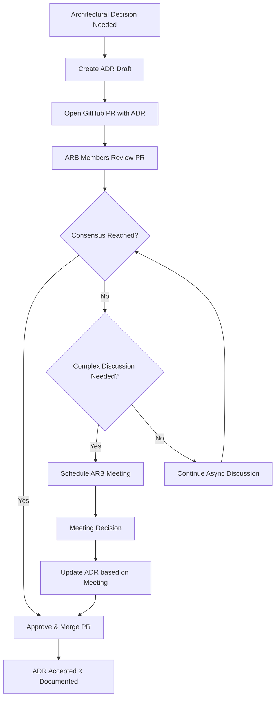

# Establish Architecture Review Board

## Status

Accepted

## Context

As our ShopFlow platform grows in complexity, we need a structured approach to review and approve architectural decisions. Currently, architectural decisions are made ad-hoc by individual teams or developers, leading to:

* Inconsistent architectural patterns across the platform
* Lack of visibility into system-wide architectural changes
* Risk of conflicting design decisions between teams
* Difficulty maintaining architectural coherence as we scale
* Limited knowledge sharing about architectural trade-offs

We considered several approaches for architectural governance:

1. **Heavyweight Architecture Review Board**: Traditional committee with regular meetings for all decisions
2. **Informal Peer Review**: Continue current ad-hoc review process  
3. **GitHub PR-based Review Process**: Structured but asynchronous review using pull requests
4. **External Architecture Consultancy**: Outsource architectural review to third parties

The team values efficiency and our existing GitHub-based workflow, while recognizing the need for more structure in architectural decision-making.

## Decision

We will establish an Architecture Review Board (ARB) that operates primarily through GitHub Pull Requests, with meetings only when asynchronous discussion is insufficient.

### Review Process

### ARB Composition
* **Technical Leads**: One from each major domain (Frontend, Backend, Data, Infrastructure)
* **Principal Engineer**: Overall architectural oversight
* **Product Architecture Representative**: Business alignment

### Review Criteria
Pull requests trigger ARB review when they:
* Introduce new ADRs
* Modify existing ADRs
* Include architectural changes affecting multiple services
* Propose new technology adoption
* Change data models or API contracts

### Meeting Escalation
Schedule synchronous meetings only when:
* PR discussion exceeds 5 business days without resolution
* Complex trade-offs require real-time discussion
* Cross-team coordination needed for implementation
* Disagreement between ARB members requires mediation

## Consequences

Positive:
* Structured yet lightweight architectural review process
* Leverages existing GitHub workflow and tooling
* Asynchronous by default, respecting distributed team schedules  
* All architectural decisions documented and searchable
* Clear escalation path for complex decisions
* Maintains development velocity while improving architecture quality

Negative:
* Additional process overhead for architectural changes
* Potential bottleneck if ARB members are unavailable for review
* Risk of extended discussion delays in PRs
* Requires discipline to follow the process consistently

Neutral:
* ARB members need to allocate time for regular PR reviews
* Meeting scheduling still required for escalated discussions
* Process will need refinement based on usage patterns
* Success depends on active participation from ARB members

### Implementation Notes
* ARB reviews use GitHub's draft PR and review features
* ADR template includes reviewer checklist
* ARB member rotation every 6 months to prevent burnout
* Quarterly retrospectives to improve the process

---

*This ADR establishes our architectural governance process using GitHub-based collaboration.*