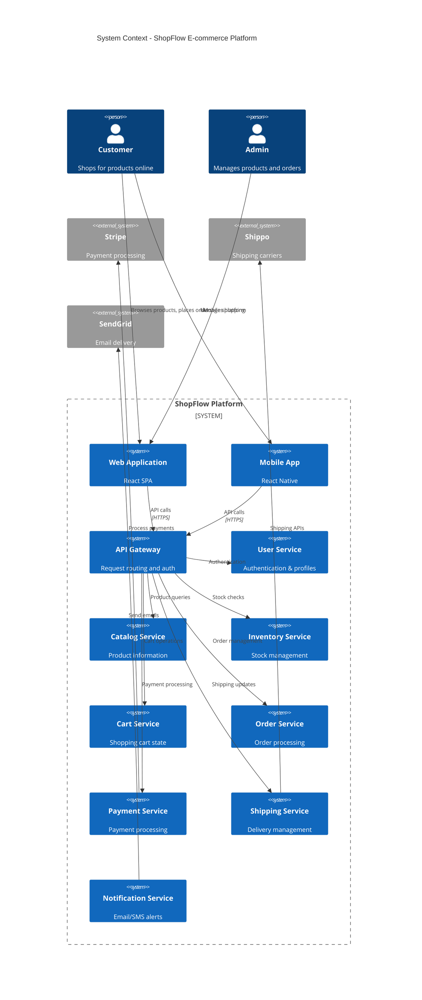

# Adopt Microservices Architecture

## Status

Accepted

## Category

Core Architecture

## Context

Our ShopFlow e-commerce platform has grown from a simple monolithic application to support multiple business domains including user management, product catalog, inventory, orders, payments, and shipping. The current monolithic architecture is experiencing several challenges:

**Current Pain Points:**
* Deployment of any change requires full system deployment
* Scaling individual components independently is impossible  
* Technology stack is locked to Java/Spring Boot across all domains
* Team coordination overhead increases with team size
* Database contention between different business functions
* Outage in one component affects the entire platform

**Business Requirements:**
* Support for 10x user growth over next 2 years
* Faster time-to-market for new features
* Different teams want to use different technology stacks
* Need for independent scaling of high-traffic components (search, checkout)
* Requirement for higher availability and fault isolation

We evaluated three architectural approaches:

1. **Continue with Monolith**: Improve current architecture with better modularization
2. **Microservices**: Decompose into separate services by business domain  
3. **Modular Monolith**: Hybrid approach with strong module boundaries

## Decision

We will adopt a microservices architecture, decomposing our platform by business domains with clear service boundaries.

### Target Architecture

### Service Boundaries
* **User Service**: Authentication, authorization, user profiles
* **Catalog Service**: Product information, categories, search
* **Inventory Service**: Stock levels, availability, reservations
* **Cart Service**: Shopping cart state, session management
* **Order Service**: Order lifecycle, order history
* **Payment Service**: Payment processing, refunds
* **Shipping Service**: Delivery options, tracking
* **Notification Service**: Email, SMS, push notifications

## Consequences

Positive:
* Independent deployability enables faster release cycles
* Teams can choose appropriate technology stacks for their domains
* Individual services can be scaled based on demand
* Fault isolation prevents cascading failures
* Better alignment with business domains and teams
* Easier to understand and maintain individual services

Negative:
* Increased operational complexity (monitoring, deployment, networking)
* Network latency between service calls
* Data consistency challenges across service boundaries
* More complex testing scenarios (integration, end-to-end)
* Higher infrastructure costs initially
* Need for new skills in distributed systems

Neutral:
* Requires investment in DevOps tooling and practices
* Team structure will need to align with service boundaries
* Service communication patterns need to be established
* Monitoring and observability become critical
* Data migration strategy needed for existing monolith

### Migration Strategy
* Phase 1: Extract User and Notification services (low coupling)
* Phase 2: Extract Catalog and Inventory services
* Phase 3: Extract Order, Payment, and Shipping services
* Phase 4: Extract Cart service and decompose remaining monolith
* Maintain API compatibility during migration
* Use Strangler Fig pattern for gradual migration

---

*This ADR establishes our architectural foundation for scaling ShopFlow as a microservices platform.*