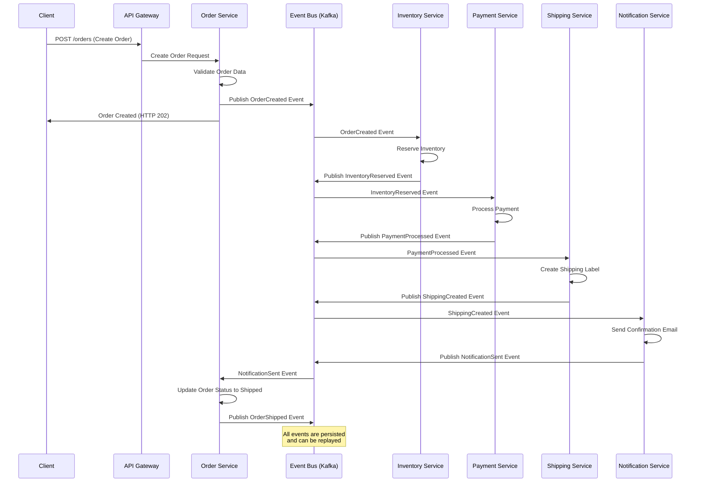

# Use Event-Driven Communication

## Status

Accepted

## Context

With our microservices architecture ([ADR-0003: Adopt Microservices Architecture](0003-adopt-microservices-architecture.md)) and database-per-service pattern ([ADR-0004: Choose Database Per Service](0004-choose-database-per-service.md)), we need to establish how services will communicate with each other. Currently, our services are designed to be independent, but several business processes require coordination across multiple services:

**Cross-Service Business Processes:**
* Order placement involves User, Catalog, Inventory, Cart, Order, Payment, and Shipping services
* Inventory updates need to notify Catalog service for product availability
* User profile changes may trigger notifications and order history updates
* Payment completion triggers order fulfillment and shipping processes
* Failed payments need to restore inventory and update order status

**Current Communication Challenges:**
* Synchronous API calls create tight coupling between services
* Cascading failures when dependent services are unavailable
* Difficulty maintaining data consistency across service boundaries
* Complex error handling and retry logic for multi-service operations
* Performance issues with sequential service calls
* Challenges with long-running processes spanning multiple services

**Requirements:**
* Loose coupling between services to improve resilience
* Reliable delivery of important business events
* Support for both real-time and batch processing
* Ability to replay events for system recovery
* Scalable communication patterns for high-volume operations
* Audit trail of all business events

We evaluated three communication patterns:

1. **Synchronous API Calls**: Direct HTTP/REST calls between services
2. **Event-Driven Architecture**: Asynchronous messaging with event bus
3. **Hybrid Approach**: Combination of synchronous and asynchronous patterns

## Decision

We will adopt an **Event-Driven Architecture** using Apache Kafka as our primary messaging platform, complemented by synchronous API calls for immediate read operations.

### Event-Driven Architecture Design



### Event Categories and Schemas

**Core Business Events:**
* `UserRegistered`, `UserUpdated`, `UserDeactivated`
* `ProductCreated`, `ProductUpdated`, `ProductDiscontinued`
* `InventoryAdjusted`, `InventoryReserved`, `InventoryReleased`
* `CartCreated`, `CartUpdated`, `CartAbandoned`
* `OrderCreated`, `OrderConfirmed`, `OrderCancelled`, `OrderShipped`
* `PaymentInitiated`, `PaymentProcessed`, `PaymentFailed`, `PaymentRefunded`
* `ShippingCreated`, `ShippingDispatched`, `ShippingDelivered`
* `NotificationSent`, `NotificationFailed`

**Event Schema Standard:**
```json
{
  "eventId": "uuid",
  "eventType": "OrderCreated",
  "eventVersion": "v1",
  "timestamp": "ISO-8601",
  "source": "order-service",
  "correlationId": "request-uuid",
  "causationId": "triggering-event-uuid",
  "data": {
    // Event-specific payload
  },
  "metadata": {
    "userId": "user-uuid",
    "sessionId": "session-uuid"
  }
}
```

### Communication Patterns

**Event-Driven (Asynchronous):**
* Business process orchestration
* Cross-service data synchronization
* Audit logging and compliance
* Background processing tasks
* System integration events

**API Calls (Synchronous):**
* Real-time data queries
* User authentication and authorization
* Immediate validation requirements
* External service integrations
* Health checks and monitoring

### Kafka Topic Architecture

| Topic | Partitions | Retention | Description |
|-------|------------|-----------|-------------|
| `user-events` | 12 | 30 days | User lifecycle events |
| `catalog-events` | 8 | 90 days | Product and catalog changes |
| `inventory-events` | 16 | 7 days | Stock level changes |
| `order-events` | 20 | 1 year | Order lifecycle events |
| `payment-events` | 12 | 7 years | Payment processing events |
| `shipping-events` | 8 | 1 year | Shipping and delivery events |
| `notification-events` | 4 | 30 days | Communication events |
| `audit-events` | 4 | 7 years | Compliance and audit trail |

## Consequences

Positive:
* Services are loosely coupled and can evolve independently
* Improved system resilience through asynchronous processing
* Natural audit trail through event persistence
* Ability to replay events for system recovery and debugging
* Scalable architecture supporting high-volume operations
* Easier to implement complex business processes across services
* Support for eventual consistency patterns

Negative:
* Increased complexity in system design and debugging
* Eventual consistency can be challenging for some business requirements
* Need for event schema management and versioning
* Higher operational overhead managing Kafka infrastructure
* More complex testing scenarios involving asynchronous flows
* Potential for event ordering issues in high-concurrency scenarios

Neutral:
* Team needs to learn event-driven design patterns
* Monitoring and observability become more complex
* Event schema evolution requires careful planning
* Duplicate event handling (idempotency) must be implemented
* Dead letter queue handling for failed event processing
* Event store becomes critical infrastructure component

### Implementation Strategy

**Phase 1: Infrastructure Setup**
* Deploy Kafka cluster with proper configuration
* Set up monitoring and alerting for Kafka
* Implement event schema registry
* Create basic event publishing/consuming libraries

**Phase 2: Core Events**
* Implement Order lifecycle events
* Add Inventory management events
* Set up Payment processing events
* Create basic event replay capabilities

**Phase 3: Extended Events**
* Add User and Catalog events
* Implement Shipping and Notification events
* Set up audit event trail
* Implement event-driven sagas for complex workflows

**Phase 4: Advanced Features**
* Event sourcing for critical business entities
* Complex event processing for real-time analytics
* Cross-region event replication
* Advanced monitoring and event flow visualization

### Event Processing Guidelines
* **Idempotency**: All event handlers must be idempotent
* **Ordering**: Use correlation IDs to track related events
* **Error Handling**: Implement dead letter queues and retry policies
* **Monitoring**: Track event processing latency and failure rates
* **Schema Evolution**: Use backward-compatible event schema changes
* **Testing**: Include event-driven scenarios in integration tests

---

*This ADR establishes event-driven communication as our primary inter-service communication pattern, enabling loose coupling and system resilience.*