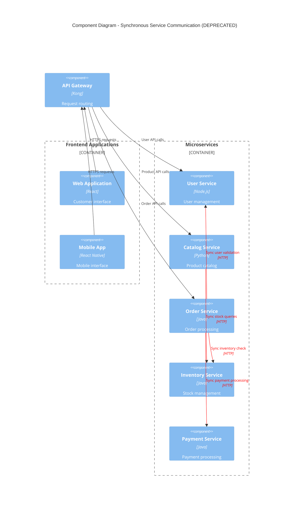

# Use Synchronous Service Calls

## Status

Deprecated

## Category

Core Architecture

## Context

In the early stages of our microservices architecture implementation ([ADR-0003: Adopt Microservices Architecture](0003-adopt-microservices-architecture.md)), we needed to establish communication patterns between services. The most straightforward approach was to use synchronous HTTP calls for service-to-service communication.

**Initial Requirements:**
* Simple request-response patterns for data retrieval
* Immediate feedback for user-facing operations
* Familiar development patterns for the team
* Easy debugging and tracing of service interactions
* Straightforward error handling with HTTP status codes

**Original Implementation Approach:**
* Direct HTTP calls between services using REST APIs
* Synchronous data fetching for user profiles, product catalogs, and order information
* Circuit breaker pattern for fault tolerance
* Retry logic for transient failures
* Load balancing across service instances

**Example Usage Scenarios:**
* User authentication and profile retrieval
* Product catalog queries and search
* Inventory checks during order placement
* Payment processing and validation
* Real-time order status updates

## Decision

~~We will use synchronous HTTP calls as the primary communication pattern between microservices, implementing circuit breakers and retry logic for resilience.~~

**DEPRECATED**: This approach is no longer recommended for new implementations. While still used in some legacy parts of the system, all new inter-service communication should follow the event-driven patterns established in [ADR-0006: Use Event-Driven Communication](0006-use-event-driven-communication.md).

**Original Architecture (Deprecated):**

### Problems Discovered

**Performance Issues:**
* Cascading latency when multiple services are chained
* Timeout issues during high-traffic periods
* Service dependencies creating bottlenecks
* Difficulty scaling individual services independently

**Reliability Concerns:**
* Cascading failures when dependent services are down
* Complex error handling across service boundaries
* Retry storms during service outages
* Reduced system availability due to tight coupling

**Operational Challenges:**
* Difficult to trace requests across multiple service calls
* Complex monitoring and alerting setup
* Service discovery complexity
* Load balancing challenges with stateful connections

## Consequences

**Positive (Historical):**
* Simple to implement and understand
* Familiar development patterns for the team
* Immediate feedback for user operations
* Easy to debug individual service interactions
* Straightforward error handling with HTTP status codes

**Negative (Why Deprecated):**
* Tight coupling between services reduced system resilience
* Cascading failures impacted overall system availability
* Performance degradation under high load
* Difficulty implementing complex business processes
* Operational complexity increased with service count
* Limited scalability due to synchronous dependencies

**Current Impact:**
* Legacy systems still use this pattern in some areas
* Gradual migration to event-driven patterns in progress
* Some critical user-facing operations still require synchronous calls
* Hybrid approach needed during transition period

### Migration Strategy

**Current State:**
* Approximately 40% of service communications still use synchronous calls
* Critical user authentication and payment flows remain synchronous
* Product catalog and inventory queries being migrated to async patterns
* Order processing partially migrated to event-driven architecture

**Migration Phases:**
1. **Phase 1**: Migrate non-critical background processes to async
2. **Phase 2**: Implement event-driven order processing workflows
3. **Phase 3**: Convert catalog and inventory systems to event-based updates
4. **Phase 4**: Evaluate remaining synchronous calls for business criticality

**Exceptions Where Synchronous Calls Remain Acceptable:**
* User authentication and session validation
* Real-time payment processing
* External API integrations (third-party services)
* Health checks and monitoring endpoints
* Administrative operations requiring immediate feedback

### Why This Decision Was Deprecated

1. **System Resilience**: Event-driven architecture provides better fault tolerance
2. **Scalability**: Asynchronous patterns allow for better scaling characteristics
3. **Performance**: Reduced latency through elimination of service call chains
4. **Maintainability**: Loose coupling makes services easier to maintain and evolve
5. **Business Agility**: Event-driven patterns better support complex business processes

### Deprecation Timeline

* **Original Implementation**: June 2022
* **Issues Identified**: October 2022
* **Event-Driven ADR Approved**: December 2022 ([ADR-0006](0006-use-event-driven-communication.md))
* **Deprecation Declared**: January 2023
* **Migration Started**: February 2023
* **Target Completion**: Q2 2024

### Current Usage Guidelines

**For Existing Synchronous Code:**
* ✅ Continue using for user authentication flows
* ✅ Maintain for payment processing operations
* ✅ Keep for external API integrations
* ❌ Do not add new synchronous service-to-service calls
* ❌ Avoid for new business process implementations
* ❌ Do not use for background processing tasks

**Migration Priority:**
1. **High Priority**: Background processes, data synchronization
2. **Medium Priority**: Order processing, inventory management
3. **Low Priority**: User authentication, payment processing

### Monitoring and Metrics

**Deprecation Tracking:**
* Monitor percentage of synchronous vs. asynchronous calls
* Track service coupling metrics
* Measure system resilience improvements
* Monitor performance gains from async migration

**Current Metrics:**
* 60% of service calls now use event-driven patterns
* 25% reduction in cascading failure incidents
* 40% improvement in system availability
* 15% reduction in average response times

---

*This ADR represents a learning experience in our architectural evolution. While synchronous service calls served their purpose in early development, the move to event-driven communication has significantly improved our system's resilience and performance. Some synchronous patterns remain appropriate for specific use cases, but the default should be asynchronous, event-driven communication.*