# Choose Database Per Service

## Status

Accepted

## Context

With our adoption of microservices architecture (ADR-0003), we need to determine our data management strategy. Our current monolithic application uses a single PostgreSQL database shared across all business domains, which creates several issues:

**Current Database Challenges:**
* Database schema changes require coordination across all teams
* Single database becomes a bottleneck for high-traffic operations
* Different domains have different data consistency requirements
* Backup and recovery affects all services simultaneously  
* Database schema conflicts between domains
* Performance optimization for one domain can negatively impact others

**Service-Specific Data Requirements:**
* **User Service**: Strong consistency for authentication, moderate read/write
* **Catalog Service**: Eventually consistent, read-heavy with complex queries
* **Inventory Service**: Strong consistency for stock levels, high write volume
* **Cart Service**: Session-based, temporary data, high performance needs
* **Order Service**: Strong consistency, audit trail requirements
* **Payment Service**: Strong consistency, PCI compliance, high security
* **Shipping Service**: Eventually consistent, integration with external APIs
* **Notification Service**: High write volume, temporary data retention

We considered three data management approaches:

1. **Shared Database**: Continue using single database across all services
2. **Database per Service**: Each service owns its data completely
3. **Hybrid Approach**: Mix of shared and service-specific databases

## Decision

We will implement a **Database per Service** pattern, where each microservice owns and manages its data independently.

### Service Data Architecture

```mermaid
C4Container
    title Container Diagram - ShopFlow Data Architecture
    
    Container_Boundary(frontend, "Frontend Applications") {
        Container(web, "Web App", "React", "Customer web interface")
        Container(mobile, "Mobile App", "React Native", "Customer mobile app")
        Container(admin, "Admin Portal", "React", "Administrative interface")
    }
    
    Container(gateway, "API Gateway", "Kong/Nginx", "Request routing, auth, rate limiting")
    
    Container_Boundary(services, "Microservices") {
        Container(userSvc, "User Service", "Node.js", "Authentication & user profiles")
        Container(catalogSvc, "Catalog Service", "Python", "Product information & search")
        Container(inventorySvc, "Inventory Service", "Java", "Stock management")
        Container(cartSvc, "Cart Service", "Node.js", "Shopping cart state")
        Container(orderSvc, "Order Service", "Java", "Order processing")
        Container(paymentSvc, "Payment Service", "Java", "Payment processing")
        Container(shippingSvc, "Shipping Service", "Python", "Delivery management")
        Container(notificationSvc, "Notification Service", "Go", "Messaging")
    }
    
    Container_Boundary(databases, "Databases") {
        ContainerDb(userDb, "User DB", "PostgreSQL", "User accounts, profiles, sessions")
        ContainerDb(catalogDb, "Catalog DB", "PostgreSQL + Elasticsearch", "Products, categories, search")
        ContainerDb(inventoryDb, "Inventory DB", "PostgreSQL", "Stock levels, reservations")
        ContainerDb(cartDb, "Cart DB", "Redis", "Shopping cart sessions")
        ContainerDb(orderDb, "Order DB", "PostgreSQL", "Orders, order history")
        ContainerDb(paymentDb, "Payment DB", "PostgreSQL", "Payment records, encrypted")
        ContainerDb(shippingDb, "Shipping DB", "PostgreSQL", "Shipping info, tracking")
        ContainerDb(notificationDb, "Notification DB", "MongoDB", "Message queue, templates")
    }
    
    Rel(web, gateway, "HTTPS")
    Rel(mobile, gateway, "HTTPS")
    Rel(admin, gateway, "HTTPS")
    
    Rel(gateway, userSvc, "User operations")
    Rel(gateway, catalogSvc, "Product queries")
    Rel(gateway, inventorySvc, "Stock checks")
    Rel(gateway, cartSvc, "Cart operations")
    Rel(gateway, orderSvc, "Order management")
    Rel(gateway, paymentSvc, "Payments")
    Rel(gateway, shippingSvc, "Shipping")
    Rel(gateway, notificationSvc, "Notifications")
    
    Rel(userSvc, userDb, "User data")
    Rel(catalogSvc, catalogDb, "Product data")
    Rel(inventorySvc, inventoryDb, "Inventory data")
    Rel(cartSvc, cartDb, "Cart data")
    Rel(orderSvc, orderDb, "Order data")
    Rel(paymentSvc, paymentDb, "Payment data")
    Rel(shippingSvc, shippingDb, "Shipping data")
    Rel(notificationSvc, notificationDb, "Notification data")
```

### Database Technology Choices

| Service | Database | Rationale |
|---------|----------|-----------|
| User | PostgreSQL | ACID compliance for authentication, structured user data |
| Catalog | PostgreSQL + Elasticsearch | Structured product data + full-text search |
| Inventory | PostgreSQL | Strong consistency for stock levels, transaction support |
| Cart | Redis | High-performance session storage, TTL support |
| Order | PostgreSQL | ACID compliance, audit trail, complex queries |
| Payment | PostgreSQL | ACID compliance, security, encryption at rest |
| Shipping | PostgreSQL | Structured data, integration with external APIs |
| Notification | MongoDB | Flexible schema for different message types |

## Consequences

Positive:
* Each service can optimize its data model for specific use cases
* Independent scaling of databases based on service needs
* Technology diversity allows choosing best tool for each domain
* Isolated failures - database issues don't cascade across services
* Independent backup and recovery strategies per service
* Teams can work independently without schema coordination

Negative:
* Increased operational complexity managing multiple databases
* Cross-service queries require API calls or data synchronization
* Data consistency across services requires eventual consistency patterns
* Higher infrastructure costs for multiple database instances
* Need for distributed transaction management for some operations
* More complex backup and disaster recovery coordination

Neutral:
* Requires expertise in multiple database technologies
* Data synchronization patterns needed between services
* Monitoring and alerting becomes more complex
* Migration from current monolithic database will be significant effort
* Need for service-to-service communication for data access

### Implementation Strategy
* **Phase 1**: Extract User and Notification databases (lowest coupling)
* **Phase 2**: Implement Cart service with Redis
* **Phase 3**: Extract Catalog database with Elasticsearch integration  
* **Phase 4**: Extract Inventory, Order, Payment, and Shipping databases
* Use database views and triggers during migration for data consistency
* Implement saga pattern for distributed transactions where needed

### Data Consistency Patterns
* **Strong Consistency**: User, Inventory, Order, Payment services
* **Eventual Consistency**: Catalog, Shipping, Notification services  
* **Session Consistency**: Cart service
* **Cross-service Communication**: Event-driven updates and API calls

---

*This ADR establishes our data architecture foundation supporting independent microservices with appropriate database technologies for each domain.*