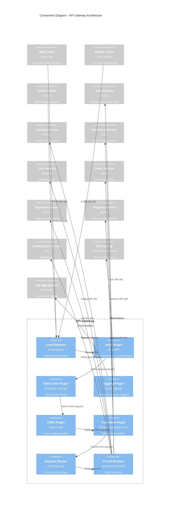

# Implement API Gateway Pattern

## Status

Accepted

## Context

With our microservices architecture (ADR-0003), we now have multiple services that need to be accessed by various client applications (web, mobile, admin portal). Without a unified entry point, we face several challenges:

**Current Client-Service Communication Issues:**
* Clients need to know about and connect to multiple service endpoints
* Cross-cutting concerns (authentication, rate limiting, logging) duplicated across services
* Different protocols and data formats across services create client complexity
* CORS configuration needed on every service for browser clients
* No centralized point for API versioning and documentation
* Difficult to implement security policies consistently
* Load balancing and failover logic scattered across clients

**Requirements:**
* Single entry point for all external API access
* Centralized authentication and authorization
* Rate limiting and throttling capabilities
* Request/response transformation and protocol translation
* Load balancing and service discovery integration
* Comprehensive logging and monitoring
* API versioning and backward compatibility support

We evaluated three approaches:

1. **No Gateway**: Clients communicate directly with services
2. **API Gateway**: Single entry point routing to backend services
3. **Backend for Frontend (BFF)**: Separate gateways per client type

## Decision

We will implement an API Gateway pattern using Kong as our gateway technology, providing a single entry point for all client-to-service communication.

### API Gateway Architecture

### Gateway Responsibilities

**Routing & Load Balancing:**
* Route requests to appropriate backend services
* Load balance requests across service instances
* Health checking and automatic failover
* Service discovery integration

**Security:**
* JWT token validation and user authentication
* API key management for different client types
* Rate limiting per user/API key/IP address
* CORS policy enforcement
* Request/response sanitization

**Protocol & Data Transformation:**
* HTTP to HTTP/gRPC protocol bridging
* Request/response data format transformation
* API versioning support (v1, v2 routing)
* Legacy API compatibility layers

**Observability:**
* Centralized access logging
* Request/response metrics collection
* Distributed tracing correlation
* Error rate and latency monitoring

### Routing Configuration

| Route Pattern | Target Service | Authentication | Rate Limit |
|---------------|---------------|----------------|------------|
| `/api/v1/auth/*` | User Service | None | 100/min |
| `/api/v1/users/*` | User Service | Required | 1000/min |
| `/api/v1/products/*` | Catalog Service | Optional | 2000/min |
| `/api/v1/inventory/*` | Inventory Service | Required | 500/min |
| `/api/v1/cart/*` | Cart Service | Required | 1000/min |
| `/api/v1/orders/*` | Order Service | Required | 200/min |
| `/api/v1/payments/*` | Payment Service | Required | 100/min |
| `/api/v1/shipping/*` | Shipping Service | Required | 300/min |
| `/admin/api/*` | All Services | Admin Role | 10000/min |

## Consequences

Positive:
* Single entry point simplifies client configuration and reduces coupling
* Centralized cross-cutting concerns reduce code duplication across services
* Consistent security policies and rate limiting across all APIs
* Simplified CORS configuration and SSL termination
* Better observability with centralized logging and metrics
* API versioning and backward compatibility support
* Circuit breaker pattern prevents cascading failures

Negative:
* API Gateway becomes a potential single point of failure
* Additional network hop introduces latency
* Gateway configuration complexity increases with service growth
* Potential bottleneck for high-traffic scenarios
* Requires expertise in gateway technology and configuration
* Debugging distributed requests becomes more complex

Neutral:
* Kong requires operational expertise and monitoring
* Gateway configuration needs to be version controlled and tested
* Service discovery integration required for dynamic routing
* Load balancer health checks need configuration
* Backup and disaster recovery planning for gateway instances

### Implementation Plan

**Phase 1: Basic Gateway Setup**
* Deploy Kong in high-availability configuration
* Configure basic routing for User and Catalog services
* Implement JWT authentication plugin
* Set up basic rate limiting

**Phase 2: Security & Monitoring**
* Configure rate limiting per service and user type
* Implement comprehensive logging and metrics
* Set up circuit breaker patterns
* Configure CORS policies

**Phase 3: Advanced Features**
* Add request/response transformation plugins
* Implement API versioning support
* Configure service discovery integration
* Set up automated failover and health checking

**Phase 4: Migration & Optimization**
* Migrate all services behind the gateway
* Optimize performance and caching strategies
* Implement advanced security features
* Set up comprehensive monitoring and alerting

---

*This ADR establishes our API Gateway as the unified entry point for all client-service communication in our microservices architecture.*