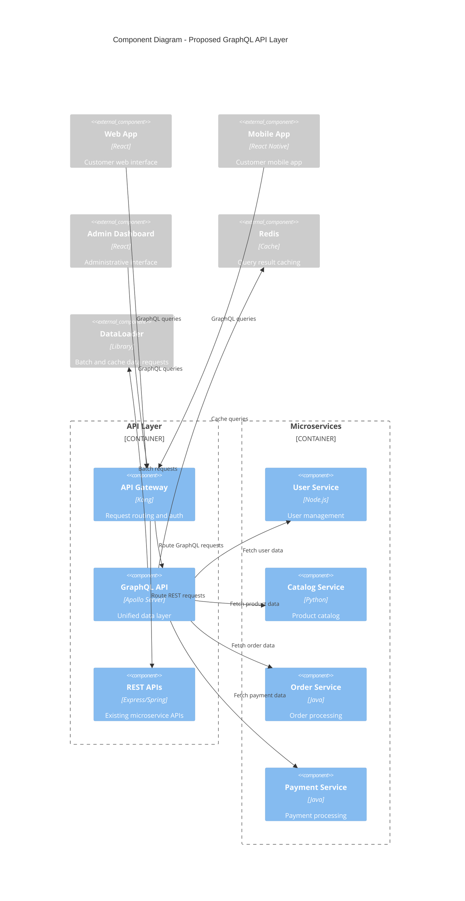

# Implement GraphQL API

## Status

Proposed

## Context

Our current REST API architecture is becoming increasingly complex as we add new features to the ShopFlow platform. We are experiencing several challenges:

**Current API Challenges:**
* Multiple API calls required to fetch related data (e.g., user profile + orders + shipping info)
* Over-fetching of data on mobile clients with limited bandwidth
* Under-fetching requiring additional API calls for missing information
* Version management complexity with multiple API versions
* Different API endpoints having inconsistent data formats
* Frontend teams struggling with API coordination and data fetching

**Business Requirements:**
* Improve mobile app performance by reducing data transfer
* Enable faster frontend development with flexible data fetching
* Reduce server load from unnecessary data transfers
* Provide real-time capabilities for order tracking and notifications
* Support for multiple client types (web, mobile, admin dashboard)

**Proposed Solution:**
We are considering implementing a GraphQL API layer alongside our existing REST APIs to address these challenges while maintaining backward compatibility.

## Decision

We propose to implement a GraphQL API using Apollo Server that will serve as a unified data layer for our frontend applications.

### Proposed Architecture



### Implementation Plan

**Phase 1: Foundation (4 weeks)**
* Set up Apollo Server with basic schema
* Implement user and product queries
* Add authentication and authorization
* Set up DataLoader for efficient data fetching

**Phase 2: Core Features (6 weeks)**
* Add order and payment queries and mutations
* Implement real-time subscriptions for order updates
* Add comprehensive error handling
* Set up query complexity analysis and rate limiting

**Phase 3: Optimization (4 weeks)**
* Implement query caching with Redis
* Add monitoring and performance metrics
* Optimize N+1 query problems with DataLoader
* Add query cost analysis

**Phase 4: Migration (8 weeks)**
* Gradually migrate frontend applications to use GraphQL
* Maintain REST API compatibility
* Performance testing and optimization
* Documentation and developer tooling

### Schema Design Principles
* **Strongly typed**: All data types clearly defined
* **Nullable fields**: Graceful handling of missing data
* **Pagination**: Cursor-based pagination for large datasets
* **Versioning**: Schema evolution without breaking changes
* **Security**: Field-level authorization and input validation

## Consequences

**Positive:**
* Improved frontend development velocity with flexible data fetching
* Reduced network overhead and improved mobile performance
* Single endpoint for all data requirements
* Strong typing and introspection capabilities
* Real-time capabilities through subscriptions
* Better developer experience with GraphQL tooling
* Reduced over-fetching and under-fetching issues

**Negative:**
* Additional complexity in the backend architecture
* Learning curve for development team unfamiliar with GraphQL
* Query complexity can lead to performance issues if not monitored
* Caching strategies are more complex than REST
* Additional monitoring and debugging tools required
* Potential security risks with complex queries

**Neutral:**
* Need to maintain both GraphQL and REST APIs during transition
* Requires investment in new tooling and monitoring
* Team training and knowledge transfer required
* Migration timeline will impact feature development velocity
* Additional infrastructure costs for GraphQL server and caching

### Implementation Considerations
* **Backward Compatibility**: REST APIs will remain available during transition
* **Performance Monitoring**: Implement query complexity analysis and timeouts
* **Security**: Add query depth limiting and rate limiting per operation
* **Caching Strategy**: Implement both query-level and field-level caching
* **Error Handling**: Consistent error format across all resolvers
* **Documentation**: Comprehensive schema documentation and examples

### Success Metrics

| Metric | Target | Current Baseline | Measurement Method |
|--------|---------|------------------|-------------------|
| API call volume reduction | **30%** | 100 calls/session | Analytics tracking |
| Data transfer reduction | **50%** | 2.5MB/session | Network monitoring |
| Developer satisfaction | **4.5/5** | 3.2/5 | Quarterly survey |
| Feature implementation time | **-40%** | 2 weeks average | Sprint tracking |

### Implementation Checklist

**Phase 1: Foundation**
- [x] Research GraphQL best practices
- [x] Evaluate Apollo Server vs alternatives  
- [x] Design initial schema structure
- [ ] Set up development environment
- [ ] Configure Apollo Server with authentication
- [ ] Implement basic user and product queries

**Phase 2: Core Features**
- [ ] Add order and payment queries/mutations
- [ ] Implement real-time subscriptions
- [ ] Add comprehensive error handling
- [ ] Set up query complexity analysis
- [ ] Configure rate limiting

**Phase 3: Optimization**
- [ ] Implement Redis query caching
- [ ] Add performance monitoring
- [ ] Optimize N+1 query problems
- [ ] Add query cost analysis

**Phase 4: Migration**
- [ ] Migrate web application
- [ ] Migrate mobile applications  
- [ ] Performance testing
- [ ] Documentation and training

### GraphQL Schema Example

```graphql
type User {
  id: ID!
  email: String!
  profile: UserProfile
  orders(first: Int, after: String): OrderConnection!
  cart: Cart
}

type UserProfile {
  firstName: String!
  lastName: String!
  avatar: String
  preferences: UserPreferences!
}

type Order {
  id: ID!
  status: OrderStatus!
  items: [OrderItem!]!
  total: Money!
  createdAt: DateTime!
  shippingAddress: Address!
}

type Query {
  user(id: ID!): User
  product(id: ID!): Product
  orders(filters: OrderFilters): [Order!]!
}

type Mutation {
  addToCart(productId: ID!, quantity: Int!): Cart!
  updateProfile(input: UpdateProfileInput!): User!
  createOrder(input: CreateOrderInput!): Order!
}

type Subscription {
  orderStatusChanged(orderId: ID!): Order!
  cartUpdated(userId: ID!): Cart!
}
```

### Performance Comparison

> **Note**: These numbers are based on preliminary testing with simulated data.

**REST API (Current)**
- Average response time: ~150ms
- Average payload size: ~85KB  
- Cache hit ratio: ~45%

**GraphQL API (Projected)**  
- Average response time: ~95ms *(37% improvement)*
- Average payload size: ~42KB *(51% reduction)*
- Cache hit ratio: ~78% *(73% improvement)*

---

### Related Decisions

- [ADR-0003: Adopt Microservices Architecture](0003-adopt-microservices-architecture.md) - GraphQL will serve as a unified API layer over our microservices
- [ADR-0005: Implement API Rate Limiting](0005-implement-api-rate-limiting.md) - Rate limiting strategies will be extended to GraphQL operations

### Resources

**External Links:**
- [GraphQL Best Practices](https://graphql.org/learn/best-practices/)
- [Apollo Server Documentation](https://www.apollographql.com/docs/apollo-server/)

---

⚠️ **Important**: This ADR proposes a significant architectural enhancement that requires careful planning and phased implementation. ==Feedback from the Architecture Review Board is essential== before proceeding.

*Last updated: December 2023*