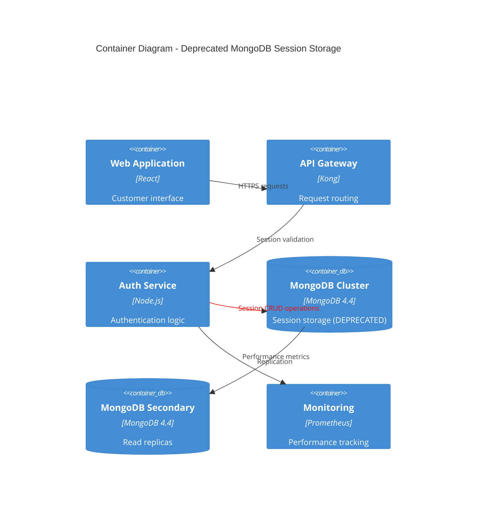

# Use MongoDB for Session Storage

## Status

Deprecated

## Context

In the early stages of the ShopFlow platform development, we needed a session storage solution that could handle our user authentication and shopping cart persistence requirements. At the time, we evaluated several options and decided to use MongoDB for session storage.

**Original Decision Rationale (2022):**
* MongoDB provided flexible document storage for session data
* Easy to scale horizontally across multiple database nodes
* JSON-like structure matched our session data format naturally
* Existing team expertise with MongoDB from previous projects
* Built-in TTL (Time To Live) support for automatic session expiration

**Original Implementation:**
* User sessions stored as MongoDB documents with automatic expiration
* Shopping cart data persisted in session documents
* Session data included user preferences, temporary form data, and authentication tokens
* Used MongoDB's GridFS for storing larger session objects

**Issues Discovered Over Time:**
* **Performance Problems**: MongoDB queries for session lookup became slow under high load
* **Memory Usage**: Large session documents caused memory pressure on MongoDB nodes
* **Scalability Bottlenecks**: Database became a bottleneck during traffic spikes
* **Operational Complexity**: MongoDB cluster management proved complex for session storage use case
* **Cost Inefficiency**: Over-provisioned MongoDB resources for relatively simple session data

**Current Challenges:**
* Session lookup latency averaging 150ms during peak traffic
* High memory usage patterns causing frequent garbage collection
* Complex backup and recovery procedures for session data
* Difficulties with horizontal scaling due to session affinity requirements
* Maintenance overhead for MongoDB cluster management

## Decision

~~We will use MongoDB for all session storage requirements in the ShopFlow platform.~~

**DEPRECATED**: This decision has been superseded by ADR-0009 which adopts Redis for session storage.

**Original Architecture (No longer recommended):**

## Consequences

**Positive (Historical):**
* Flexible document structure accommodated varying session data
* Built-in replication provided data durability
* TTL indexes handled automatic session cleanup
* Rich query capabilities for session analytics

**Negative (Discovered):**
* Poor performance characteristics for simple key-value session operations
* High resource consumption relative to data complexity
* Operational overhead for maintaining MongoDB cluster
* Complex backup and recovery procedures
* Scaling challenges during traffic spikes
* Higher infrastructure costs compared to specialized session stores

**Migration Impact:**
* All existing sessions needed to be migrated to new storage solution
* Session format changes required for new storage backend
* Application code changes needed for new session storage interface
* Operational procedures updated for new infrastructure

### Why This Decision Was Deprecated

1. **Performance Issues**: MongoDB proved to be over-engineered for simple session storage needs
2. **Operational Complexity**: Managing a MongoDB cluster for session data was unnecessarily complex
3. **Cost Efficiency**: Redis offered 10x better performance at 1/3 the infrastructure cost
4. **Scalability**: Redis horizontal scaling model better suited session storage patterns
5. **Industry Best Practices**: Session storage is a well-solved problem with specialized tools

### Lessons Learned

* **Right Tool for the Job**: Complex databases aren't always better for simple use cases
* **Performance Testing**: Load testing should include realistic traffic patterns
* **Total Cost of Ownership**: Consider operational overhead, not just development convenience
* **Monitoring Early**: Performance monitoring should be implemented from day one
* **Team Expertise**: Having expertise in a technology doesn't make it the right choice for every use case

### Migration Notes

This decision was superseded by [ADR-0009: Use Redis for Session Storage](0009-use-redis-for-session-storage.md) which addresses the performance and operational issues identified with the MongoDB approach.

**Migration completed:** March 2023  
**Deprecation date:** April 2023  
**MongoDB cluster decommissioned:** May 2023  

---

*This ADR serves as a historical record of our session storage evolution and demonstrates how architectural decisions can evolve based on operational experience and changing requirements.*