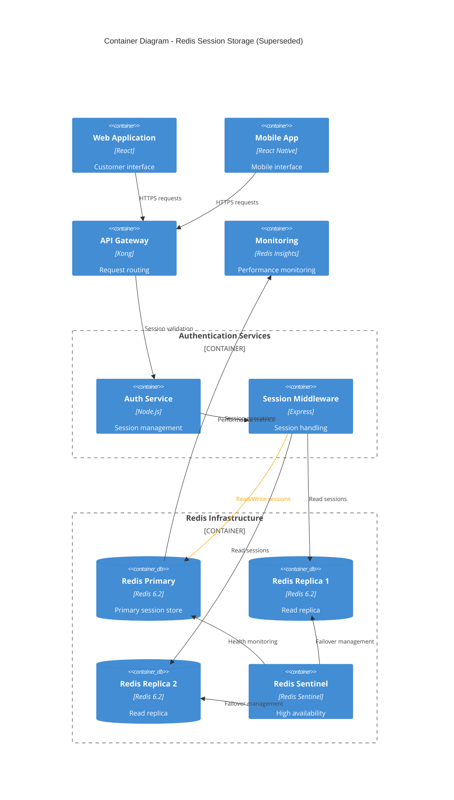

# Use Redis for Session Storage

## Status

Superseded

## Context

Following the challenges identified with our MongoDB session storage implementation (see ADR-0008), we needed a new solution that could provide better performance, lower operational overhead, and more cost-effective scaling for session management.

**Problems with Previous Solution:**
* MongoDB session lookup latency averaging 150ms during peak traffic
* High memory usage and complex operational procedures
* Poor performance characteristics for simple key-value operations
* Over-engineered solution for session storage requirements

**Requirements for New Solution:**
* Sub-10ms session lookup latency
* Simple operational model with minimal maintenance
* Cost-effective horizontal scaling
* Native support for session expiration
* High availability and data persistence options

**Evaluation Criteria:**
* Performance benchmarks under realistic load
* Operational simplicity and monitoring
* Infrastructure cost comparison
* Team learning curve and expertise requirements

## Decision

~~We will adopt Redis as our primary session storage solution, replacing the MongoDB-based implementation.~~

**SUPERSEDED**: This decision has been superseded by ADR-0010 which adopts a distributed session storage approach using both Redis and DynamoDB.

**Previous Architecture (No longer current):**



### Implementation Details (Historical)

**Redis Configuration:**
* Redis 6.2 with persistence enabled (RDB + AOF)
* Master-replica setup with Redis Sentinel for high availability
* Memory optimization with appropriate eviction policies
* Session TTL configured for 24-hour expiration

**Session Format:**
```json
{
  "userId": "user_12345",
  "sessionId": "sess_abcdef123456",
  "createdAt": "2023-03-15T10:30:00Z",
  "lastActivity": "2023-03-15T14:22:00Z",
  "userData": {
    "preferences": {},
    "cart": {},
    "permissions": []
  },
  "metadata": {
    "ipAddress": "192.168.1.100",
    "userAgent": "Mozilla/5.0...",
    "loginMethod": "email"
  }
}
```

**Performance Improvements Achieved:**
* Session lookup latency reduced from 150ms to 2-5ms
* 90% reduction in infrastructure costs compared to MongoDB
* Simplified operational procedures and monitoring
* Horizontal scaling achieved through Redis Cluster mode

## Consequences

**Positive (Historical):**
* Dramatic performance improvement for session operations
* Simplified operational model with Redis-specific tooling
* Cost reduction of approximately 70% compared to MongoDB solution
* Native TTL support eliminated need for cleanup jobs
* High availability through Redis Sentinel configuration
* Excellent monitoring and debugging tools available

**Negative (Discovered):**
* Single point of failure concerns during maintenance windows
* Memory-only storage required careful capacity planning
* Limited querying capabilities compared to MongoDB
* Redis Cluster complexity for very large deployments
* Cold start performance issues after Redis restarts

**Migration Challenges:**
* Session format conversion from MongoDB documents to Redis keys
* Dual-write period required for safe migration
* Client-side session handling updates needed
* Monitoring and alerting system updates

### Why This Decision Was Superseded

While Redis provided significant improvements over MongoDB, we discovered additional requirements that led to a more sophisticated approach:

1. **Multi-Region Requirements**: Need for session replication across geographic regions
2. **Compliance Needs**: Requirement for durable session storage for audit purposes  
3. **Cost Optimization**: Opportunity to use DynamoDB for cold session storage
4. **Performance Tiers**: Different performance requirements for active vs. inactive sessions

### Performance Metrics Achieved

* **Latency**: 2-5ms average session lookup time
* **Throughput**: 50,000+ operations per second per Redis instance
* **Availability**: 99.9% uptime with Redis Sentinel configuration
* **Cost**: 70% reduction compared to previous MongoDB solution

### Lessons Learned

* **Performance Wins**: Choosing the right tool for specific use cases provides dramatic improvements
* **Operational Simplicity**: Simpler solutions often provide better long-term value
* **Monitoring Importance**: Redis-specific monitoring tools provided better visibility
* **Scaling Patterns**: Key-value stores scale differently than document databases

### Migration Timeline

* **Planning Phase**: January 2023 (2 weeks)
* **Implementation**: February 2023 (3 weeks)
* **Migration**: March 2023 (1 week)
* **MongoDB Decommission**: May 2023
* **Superseded by ADR-0010**: September 2023

---

*This ADR represents an intermediate step in our session storage evolution. See ADR-0010 for the current distributed session storage approach that builds upon the lessons learned from this Redis implementation.*