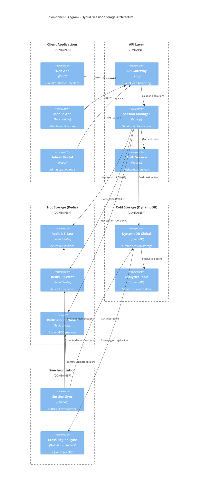
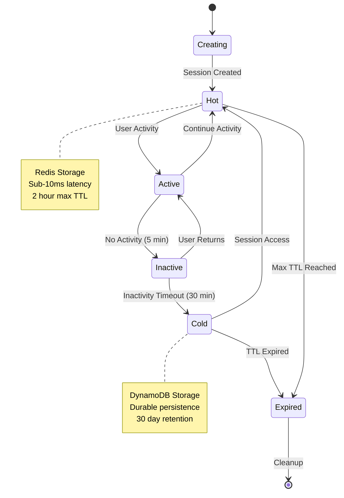
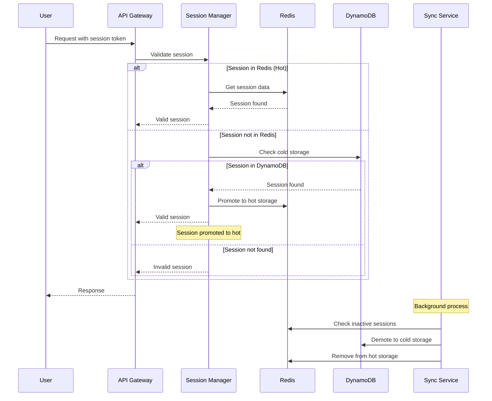

# Adopt Hybrid Session Storage

## Status

Accepted

## Context

Our Redis-based session storage solution (ADR-0009) has served us well, but as ShopFlow has grown globally, we've encountered new requirements that necessitate a more sophisticated approach to session management.

**Current Challenges with Redis-Only Approach:**
* **Geographic Distribution**: Users across multiple regions experience latency accessing centralized Redis
* **Compliance Requirements**: New regulatory requirements mandate durable storage of session data for audit trails
* **Cost Optimization**: Redis memory costs are high for storing inactive sessions that are rarely accessed
* **Disaster Recovery**: Need for cross-region session replication for business continuity
* **Session Analytics**: Limited ability to perform analytics on historical session data

**New Business Requirements:**
* Support for users in North America, Europe, and Asia-Pacific regions
* Compliance with GDPR, CCPA, and SOX auditing requirements
* Cost optimization for sessions with different access patterns
* 99.99% availability target including disaster recovery scenarios
* Session analytics for business intelligence and fraud detection

**Technical Requirements:**
* Sub-10ms latency for active sessions
* Cross-region replication with eventual consistency
* Durable storage for compliance and analytics
* Cost-effective storage for inactive sessions
* Seamless failover between regions

## Decision

We will implement a hybrid session storage architecture that combines Redis for hot session data with DynamoDB for durable and cold session storage.

### Hybrid Architecture Design



### Session Lifecycle Management

**Hot Session (Redis):**
* Active sessions accessed within last 30 minutes
* Stored in regional Redis clusters for optimal latency
* Automatic expiration after 2 hours of inactivity
* Cross-region backup for disaster recovery

**Cold Session (DynamoDB):**
* Sessions older than 30 minutes of inactivity
* Durable storage with cross-region replication
* Used for session resurrection and compliance
* Analytics and reporting capabilities

**Session Promotion/Demotion:**
* **Promotion**: Cold → Hot when session becomes active
* **Demotion**: Hot → Cold after inactivity threshold
* **Automatic**: Background service manages transitions
* **Seamless**: Invisible to application logic

### Session State Transition Flow



### Dynamic Session Access Flow



### Implementation Strategy

**Phase 1: DynamoDB Foundation (4 weeks)**
* Set up DynamoDB tables with global secondary indexes
* Implement session sync service using Lambda
* Create cross-region replication with DynamoDB Global Tables
* Build monitoring and alerting for hybrid system

**Phase 2: Hot/Cold Logic (3 weeks)**
* Implement session manager with hot/cold awareness
* Build promotion/demotion algorithms
* Add regional Redis cluster support
* Implement failover mechanisms

**Phase 3: Migration (2 weeks)**
* Gradual migration from Redis-only to hybrid model
* A/B testing with percentage of traffic
* Performance validation and optimization
* Full production rollout

**Phase 4: Optimization (3 weeks)**
* Fine-tune promotion/demotion thresholds
* Implement advanced caching strategies
* Add session analytics and reporting
* Performance optimization and cost analysis

### Configuration Parameters

```yaml
session_config:
  hot_storage:
    ttl: 7200  # 2 hours
    promotion_threshold: 1800  # 30 minutes
    regions:
      - us-east-1
      - eu-west-1
      - ap-southeast-1
  
  cold_storage:
    ttl: 2592000  # 30 days
    compliance_retention: 7776000  # 90 days
    analytics_retention: 31536000  # 1 year
  
  sync:
    batch_size: 100
    sync_interval: 300  # 5 minutes
    cross_region_delay: 30  # seconds
```

## Consequences

**Positive:**
* **Performance**: Sub-5ms latency for active sessions via regional Redis
* **Cost Optimization**: 60% reduction in Redis costs by offloading inactive sessions
* **Compliance**: Durable DynamoDB storage meets audit and regulatory requirements
* **Global Scale**: Regional Redis clusters provide optimal performance worldwide
* **Disaster Recovery**: Cross-region replication ensures business continuity
* **Analytics**: Rich session data available for business intelligence
* **Flexibility**: Can adjust hot/cold thresholds based on usage patterns

**Negative:**
* **Complexity**: More sophisticated architecture requiring careful orchestration
* **Consistency**: Eventual consistency between hot and cold storage layers
* **Operational Overhead**: Multiple storage systems require specialized monitoring
* **Development Complexity**: Session manager logic more complex than single-store approach
* **Debugging**: Distributed session state can be challenging to troubleshoot

**Neutral:**
* **Migration Effort**: Significant one-time effort to implement hybrid system
* **Team Training**: Engineering team needs expertise in both Redis and DynamoDB
* **Monitoring**: Enhanced observability required for multi-tier storage
* **Cost Model**: Different cost structure with usage-based DynamoDB pricing

### Success Metrics

**Performance Targets:**
* < 5ms latency for hot session access (95th percentile)
* < 50ms latency for cold session promotion (95th percentile)
* 99.99% availability across all regions
* < 1% session loss during region failover

**Cost Targets:**
* 50%+ reduction in total session storage costs
* Optimal cost per active user across regions
* Predictable scaling costs with usage growth

**Compliance Targets:**
* 100% session audit trail retention
* < 1 second session data retrieval for compliance queries
* Cross-region data sovereignty compliance

### Monitoring and Alerting

* **Hot/Cold Ratio**: Track percentage of sessions in each tier
* **Promotion/Demotion Rates**: Monitor session lifecycle transitions
* **Cross-Region Latency**: Track replication performance
* **Cost Optimization**: Monitor cost per session across storage tiers
* **Availability Metrics**: Track uptime across all regions and storage layers

---

*This ADR represents our current approach to session storage, combining the performance benefits of Redis with the durability and cost advantages of DynamoDB in a globally distributed architecture.*